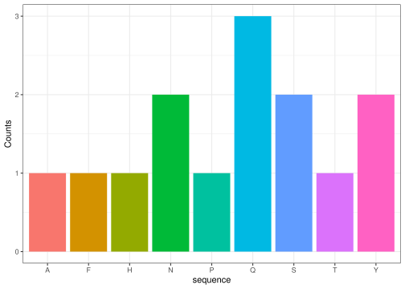
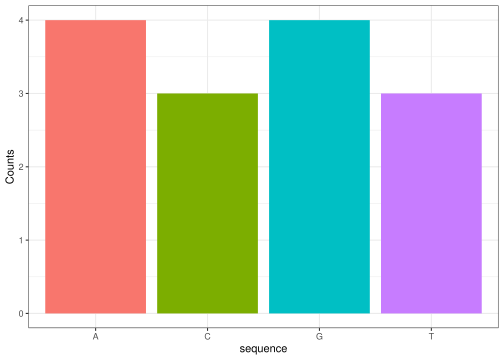

<!-- README.md is generated from README.Rmd. Please edit that file -->

# firstdogma

<!-- badges: start -->
<!-- badges: end -->

Link to gitHub repository:

<https://github.com/rforbiodatascience25/group_15_package/tree/master>

Load the firstdogma library to access the five functions made in class

``` r
library("firstdogma")
```

First function generates a random DNA sequence.

``` r
generate_dna_sequence(50)
#> [1] "TGGGCGCCGTCCGTACAATTAACTCGGGGTGGCTGAAACGAGCGTATAAT"
```

It will give randomly generated DNA sequence with a length of 50 bases.

Second function substitutes T by U like in transcription phase, where
DNA is transcribed in mRNA

``` r
T_to_U("TATATA")
#> [1] "UAUAUA"
```

Third function - the split_codons function - allows you to split a
nucleotide sequence into codons

``` r

split_codons("ATGCGTACG")
#> [1] "ATG" "CGT" "ACG"
```

If you want to start somewhere else use the start argument like below

``` r
split_codons("ATGCGTACG", start = 2)
#> [1] "TGC" "GTA"
```

The fourth function translates the character vector of codons into
respective amino acids based on codon_table defined previously. This is
the translation phase of the central dogma.

``` r
translation(codon_table)
#> [1] "NANANANANANANANANANANANANANANANANANANANANANANANANANANANANANANANANANANANANANANANANANANANANANANANANANANANANANANANANANANANANANANANA"
```

`AA_counts_plot` takes a sequence of amino acid one letter codes as a
string and generates a bargraph of the counts for each amino acid. It
also works with DNA or RNA sequences. Any characters which do not
correspond to an amino acid one letter code or DNA/RNA will be ignored.

To use, simply call it with a string of amino acids or DNA/RNA:

``` r
#Amino acids sequence 
AA_counts_plot("SSFPTAYYHQNNQQ")
```



``` r

#DNA 
AA_counts_plot("GGTACCTAGGATCA")
```


